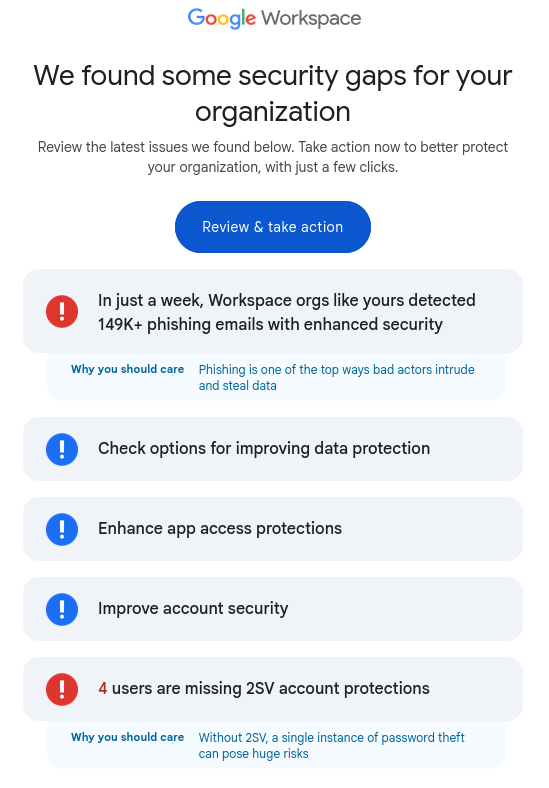
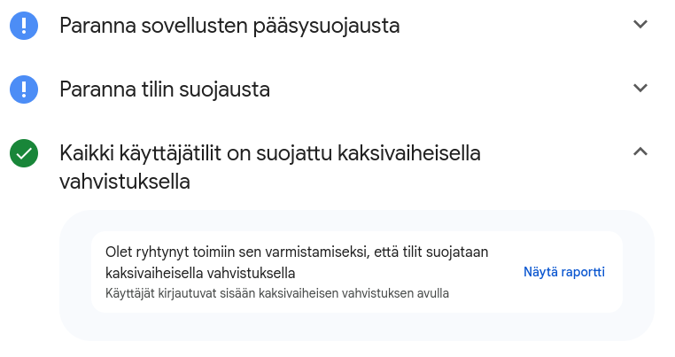
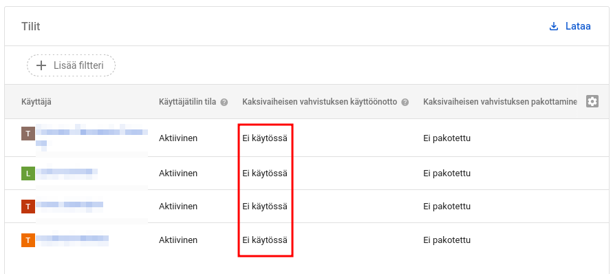

My mom's business uses Google Workspaces. She received a scary-sounding email with subject:

> [Notice] Possible unresolved security risks in your Admin Console

The email:

Note:

- Scary-looking number of phishing emails

- 4 users are missing 2SV account protections

  * Do they think mom and pop style shops know what "2SV" means? I didn't even know it's the du jour term for multi-factor authentication.

Then when my mom forwards me this email to ask if there's something to react to, and I **log in to view the report** to
see what actions they recommend doing:

- Turn on [Chrome Enterprise Core](https://chromeenterprise.google/products/chrome-enterprise-core/)
  * this gives Google even more data from users' browser
- [Gmail security sandboxing](https://knowledge.workspace.google.com/admin/gmail/advanced/gmail-security-sandbox-overview)
  * this is a paid feature
- [Security advisor for data protection](https://knowledge.workspace.google.com/admin/security/security-advisor-for-data-protection)
  * this is a paid feature

Curiously, it falsely claims that all user accounts are protected with 2SV:

Which I know *is not the case*. Then inspecting the report by clicking the link, it shows none of the accounts have 2SV enabled:

It is weird that it did lie like that in the security advisor. It looks like it only tried to spread fear to upsell and
then lie about the most impactful security step my mom could take (turn on 2SV).

Google truly is the new Microsoft.
